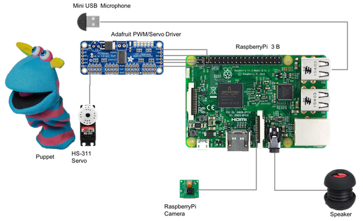

# Puppet Bot
PuppetBot is a cloud powered chatter robot (chatbot) written in python. It is a robot which can have conversations with the end users. PuppetBot has a camera and is capable of staring conversation when it detects a human face in front of it. It is an actual robot which can make voice appropriate lip movements. PuppetBot uses AWS Lex as its chatbot engine. AWS Rekognition for detecting faces in images. AWS Polly for converting conversations into visemes, which are used as an input to control lip motion. 

<!-- bullet points -->

<!--## Video-->

<!-- TODO create and add a new video--> 
[](https://www.youtube.com/watch?v=JvpXXcilbNg)

## Introduction

At work we give a lot of importance to promotion of STEM education. Every year employees bring their kids to work for a Halloween party. The team that decorates their area the best wins a lunch at a fancy restaurant. Its a tough challenge when you have so many creative minds and roboticists fighting against each other to win the challenge. For our group we initially wanted to build a conversation bot which can have conversations and dispense candy, after two or three iterations on the plan and some research we decided to build a Puppet which can talk and dispense candy. We finally designed our puppet to detect when a human is interested in talking to it and start a conversation. This is what we wanted our bot to do

1. Detect when a human is in front of it.
2. Start a conversation. This is a combinations of 3 tasks.
    - Get the audio message from the back-end and play the message.
    - While playing the audio animate the puppet's lips to match the speech in the audio.
    - Listen to what human has to say and continue these 3 tasks until the conversation is complete   
3. Once the conversation is done, dispense candy if the human asked for it.

AWS currently offers 3 powerful AI services Rekognition, Lex and Polly. Rekognition is an image recognition service, this service is capable of detecting faces in an image (information on more features and details can be found in the [docs](http://docs.aws.amazon.com/lex/latest/dg/what-is.html)). We used face detecting capabilities of Rekognition to detect when a human is interested in talking to our robot. . <!-- more infor on Rekognition polly and lex --> AWS Lex offers a serverless chatbot backend and it has nice interface to build conversations. Lex carries out conversations either in the form of text or speech (audio). Hence we use chatbot capabilities of Lex to power robots conversations. Now comes the crucial part, puppet's lips animation, that is speech appropriate lip movement. It is a service that turns text into lifelike speech that uses advanced deep learning technologies to synthesize speech that sounds like a human voice. It is also capable of providing us with visemes. Visemes are the basic visual building blocks of speech. A viseme represents the position of the face and mouth when saying a word. It is the visual equivalent of a phoneme, which is the basic acoustic unit from which a word is formed.  <!-- What is polly, explaination on visemes, more information on visemes and how polly genereated visemes are used -->


# Cloud Architecture

The back-end of the Puppet bot is powered by AWS. As mentioned above Puppet bot uses AWS Rekognition, Lex and Polly services. 
Credentials(```AccessKey```, ```AccessKeyId``` and sometimes ```SessionToken```) are necessary to make calls to AWS services.
So first we need a way to obtain these credentials from AWS. Then we also need a chatbot configured in Lex, which will power our bot's conversations.

AWS Cognito is a service which provides users with credentials. These credentials are temporary and need to be refreshed every now and then. You can also create a new IAM user and use the credentials for the IAM user for running the bot, but whats the fun in that ?


For obtaining credentials from Congito one needs to follow an authentication flow. More information on the authentication flows can be found [here](https://docs.aws.amazon.com/cognito/latest/developerguide/amazon-cognito-user-pools-authentication-flow.html). For this project Custom Authentication Flow is used. Once these credentials are obtained we use [SigV4](https://docs.aws.amazon.com/general/latest/gr/signature-version-4.html) signed requests to make calls.


Once we have the credentials we send an image to Rekonition and get details on faces found in the image. We send a dialog from the user to Lex and receive another audio file which contains the response. Similarly we send the a dialog to Polly and obtain the visemes which can be used to animate the bot.


The figure above shows the interactions of the bot with the AWS service. First it obtains credentials, at a set frequency captures images and uses Rekognition to identify if a person is in the image. If a person is detected it starts a conversation with the person by using Lex. Finally it uses the Polly for animating its mouth while talking.


# Hardware

<!-- More instructions on how to build the hardware -->

Here is the list of hardware necessary for building the robot. 

- [RaspberryPi 3 B](https://www.raspberrypi.org/products/raspberry-pi-3-model-b/)  
- [Adafruit PWM/Servo Driver PCA9685](https://www.adafruit.com/product/815)
- [Mini USB Microphone](https://www.adafruit.com/product/3367?gclid=CjwKCAiA0IXQBRA2EiwAMODil_f4pfL5HIyQv3--2iSg2KBAKOApJqYzJGe6rsbbGreYuJk_jjt5NxoCq-QQAvD_BwE)
- [Speaker](https://www.walmart.com/ip/AYL-Portable-Mini-Capsule-Speaker-System-3YR-Guarantee-Rechargeable-Battery-Expandable-Bass-Resonator-Smartphones-Tablets-MP3-Players-Computers-Lapto/827353513?wmlspartner=wlpa&selectedSellerId=7755&adid=22222222227073904874&wmlspartner=wmtlabs&wl0=&wl1=g&wl2=c&wl3=186852545962&wl4=pla-291600537048&wl5=9001880&wl6=&wl7=&wl8=&wl9=pla&wl10=115780056&wl11=online&wl12=827353513&wl13=&veh=sem)
- [Puppet](https://www.amazon.com/dp/B0012GJI36/ref=pe_2640190_232586610_TE_dp_i1)
- [RaspberryPi Camera](https://www.amazon.com/Raspberry-5MP-Camera-Board-Module/dp/B00E1GGE40)
- [Servo HS-311](https://www.servocity.com/hs-311-servo)


 
# Run the following steps

1. [Configure Cogntio for Authentication of the bot](./parts/configure_cognito.md)
2. [Build a chatbot using Lex](./parts/configure_chatbot.md)
3. [Configure RaspberryPi](./parts/install_software.md)

# Moment of truth

If all the steps are followed properly everything should be ready to start the bot. SSH into the raspberry pi and type the following command.

```
cd PuppetBot
sudo python bot.py puppetbot start
```


