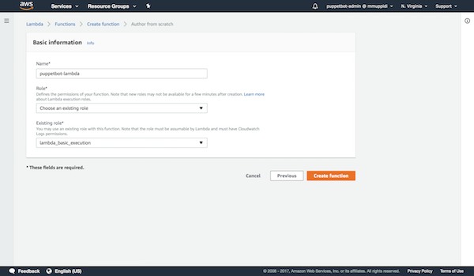
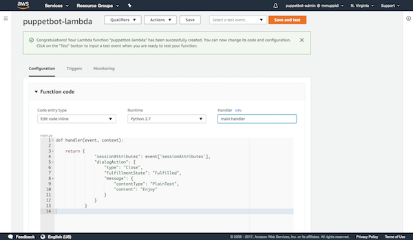
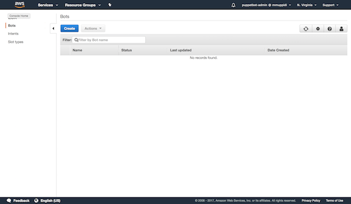
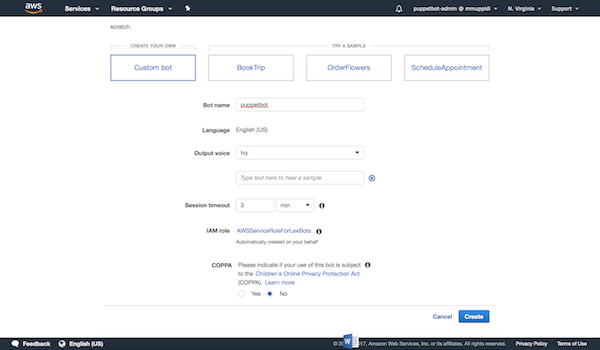
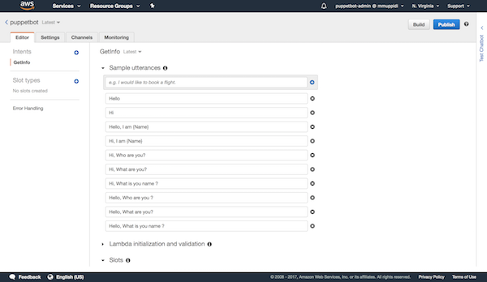
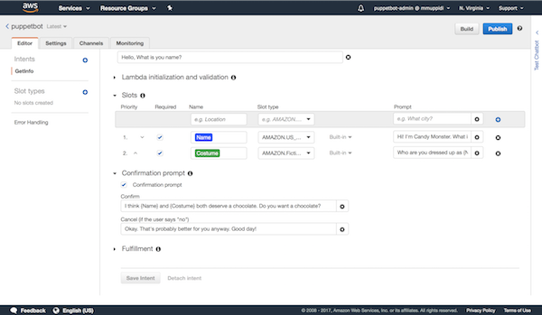
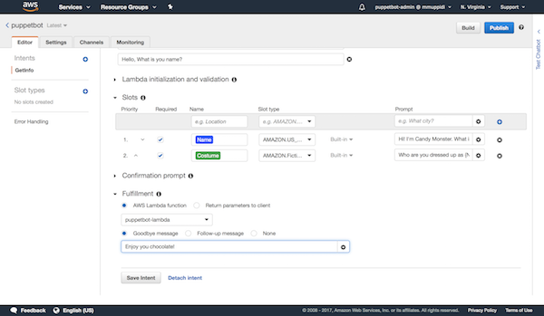

# Building a Chatbot using Lex

<!--
talk something about lex and chat bots

!-->

Lets create a Halloween chatbot which is capable of having a simple conversation. The goal of the chatbot is to collect a user's name, the costume they are wearing and know if the user would like to have a chocolate. Before continuing any further make sure that you are familiar with AWS Lex vocabulary. For details on AWS Lex visit this documentation [page](http://docs.aws.amazon.com/lex/latest/dg/what-is.html)  

First lets define a blueprint for our chatbot, that is, the ```Intents```, ```Slots```, ```Utterances```, ```Prompts``` etc,. for our chatbot. 

### Blueprint:
```
    Intent : GetInfo
    Slots : 
        - Name (AMAZON.US_FIRST_NAME built-in type) 
        - Costume (AMAZON.FictionalCharacter built-in type) 
    Utterance :
        - "Hello"
        - "Hi"
        - "Hello, I am {Name}"
        - "Hi, I am {Name}"
        - "Hi, Who are you " 
        - "Hi, What are you "
        - "Hi, What is you name "
        - "Hello, Who are you " 
        - "Hello, What are you "
        - "Hello, What is you name "
    Prompts :
        Name prompts :
            - "Hi! I'm Candy Monster. What is your name ?"
        Costume prompts :
            - "Who are you dressed up as {Name}?"
        Confirmation prompt :
            - "I think {Name} and {Costume} both deserve a chocolate. Do you want a chocolate?"
        Cancel (if the user says "no") prompt :
            - "Okay. That's probably better for you anyway. Good day!"
    Fulfillment message:
        Goodbye message:
            - "Enjoy you chocolate!"
```

### Steps to create the chatbot:

Before working on the chatbot, lets build a lambda which we would use while building the chatbot. Login to the aws console with your credentials and visit this [page](https://console.aws.amazon.com/lambda/) and click on ```Create function```, then click on ```Author from scratch```. This should take you to a page which look like the image below. Enter the name for the lambda as ```puppetbot-lambda``` and for ```role``` select ```Create a custom role```. This should take you to a new page, just click ```Allow```. Then you are be back on the previous page, just click on create function.




Now select the ```Runtime``` as ```Python 2.7``` and change the name of Handler from ```lambda_function.lambda_handler``` to ```main.handler```. Copy and paste the following code into the ```Function code```. Hit ```Save```

```
def handler(event, context):
    return {
                "sessionAttributes": event['sessionAttributes'],
                "dialogAction": {
                    "type": "Close",
                    "fulfillmentState": "Fulfilled",
                    "message": {
                        "contentType": "PlainText",
                        "content": "Enjoy"
                    }
                }   
            }


```




Now lets build our chatbot. Visit this [page](https://console.aws.amazon.com/lex), it should look something like this.



Click on ```Create``` button and then select ```Custom bot```. Lets name our bot as ```puppetbot``` and choose ```Output voice``` as ```Ivy```. I personally like Ivy voice for this project as it has a robotic flavor to it. Our chatbot's conversion is small and shouldn't exceed more than 3 mins, so lets set ```Session timeout``` as 3 mins. For ```COPPA``` select ```No``` for now. Click on ```Create``` button, this create our chatbot.



Once the chatbot is created select ```Create intent``` and then select ```Create new intent```. As we want to create an intent with name ```GetInfo``` enter it into the input box and click on ```Add``` button. Add all the Utterances from our blueprint into the ```Sample utterances``` section.



Now fill the Slots and Prompts from our blueprint into the respective sections.



Now click on ```Fulfillment``` section, select ```AWS Lambda function```, select ```puppetbot-lambda``` which we created earlier and enter "Enjoy you chocolate!" as ```Goodbye message```. Hit ```Save Intent``` button. We successfully created the chatbot, now lets publish it.



Click on ```Build```. Once the build is finished click on ```Publish``` button, enter ```dev``` in ```Create as alias``` input and hit ```Publish```. Now our chatbot is up and ready!