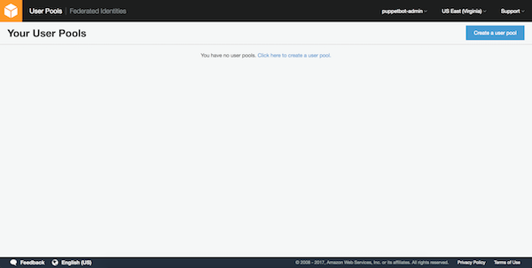
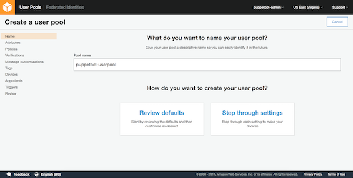
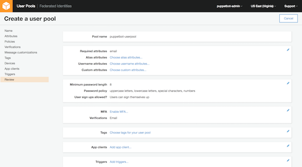
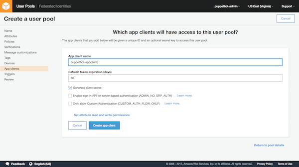
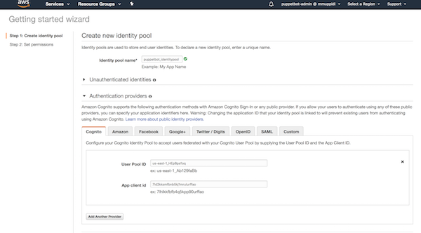
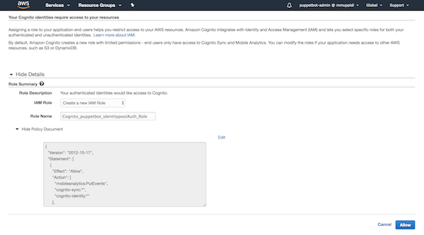
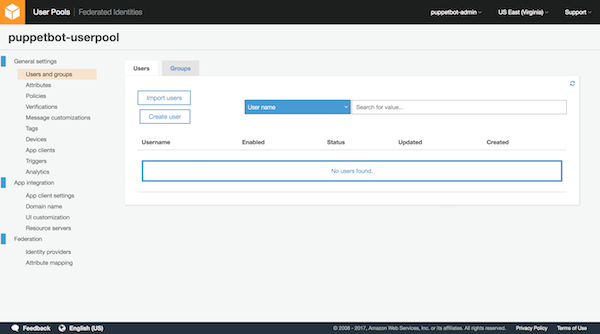

# Configure Cognito

Cognito service is made up of Cognito User Pools and Cogntio Identity Pools. 

<!--

more info on what conito is and user pools/ identity pools
!-->

## Creating a Cognito User Pool

First create a user pool. Login to AWS console using your credentials. Visit this [page](https://console.aws.amazon.com/cognito/users). This should take you to the page which looks like this.



Create a user pool with name puppetbot-userpool. Click on ```Create a user pool``` button near the right corner of the page.



Click on ```Review defaults``` button. This should take you to a page which looks like this



Click on ```Add app client``` and create a new app client with name ```puppetbot-appclient```. We will use this client when creating the identity pool. After creating the app client click on return to pool details.



Finally click on ```Create Pool``` and the User Pool is created. Now lets create a Cognito Identity Pool. Note down the Pool Id and App Client Id from details page.  

## Creating a Cognito Identity Pool 

This [link](https://console.aws.amazon.com/cognito/create) should take you to the Cognito Indenity Pool create page, which looks like what's shown below. Enter ```puppetbot_identitypool``` into the Identity pool name and click on ```Create pool```



Click on edit next to ```Cognito_puppetbot_identitypoolAuth_Role``` role and copy paste the policy from below. Click ```Allow```



```
{
    "Version": "2012-10-17",
    "Statement": [
        {
            "Effect": "Allow",
            "Action": [
                "rekognition:CompareFaces",
                "rekognition:DetectFaces",
                "rekognition:DetectLabels",
                "rekognition:ListCollections",
                "rekognition:ListFaces",
                "rekognition:SearchFaces",
                "rekognition:SearchFacesByImage"
            ],
            "Resource": "*"
        },
        {
            "Effect": "Allow",
            "Action": [
                "polly:DescribeVoices",
                "polly:GetLexicon",
                "polly:ListLexicons",
                "polly:SynthesizeSpeech"
            ],
            "Resource": [ "*" ]
        },
        {
            "Action": [
                "lex:PostContent",
                "lex:PostText"
            ],
            "Effect": "Allow",
            "Resource": "*"
        },
        {
            "Effect": "Allow",
            "Action": [
                "mobileanalytics:PutEvents",
                "cognito-sync:*",
                "cognito-identity:*"
            ],
            "Resource": [
                "*"
            ]
        }
    ]
}
```

Now the Cognito Identity pool is also configured.


# Create credentials for PuppetBot 

Go back to Userpools and click on newly created puppetbot-userpool. Then click on ```Users and Groups``` menu item which should take you to a page which looks like the one below. Create user and note down the username and password. We will use these credentials in our PuppetBot config.yaml file.




At the end we need all this information for config.yaml. Fill all the information and add it to ```CognitoAuthenticator``` section of config.yaml.

```
username: < username we created in previous step >
password: < password we created in previous step >
cognito_pool_id: < user pool id >
client_id: < app client id >
identity_pool_id: < idenitity pool id >
region_name: < aws region name >
```


