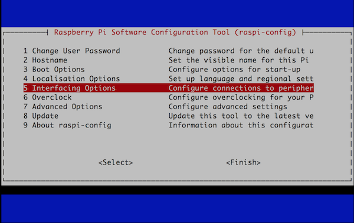
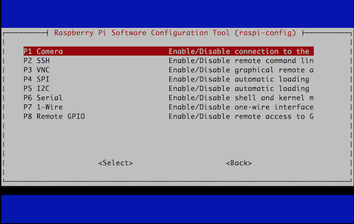
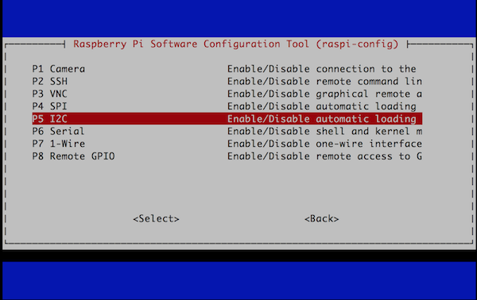

# Install Software

## Configure RaspberryPi

### Installing Raspbian on RaspberryPi
Below are the instructions to configure headless Raspberry Pi setup with Wi-Fi. 
Current setup has been tested on this [Raspbian Jessie image](https://downloads.raspberrypi.org/raspbian/images/raspbian-2017-07-05/2017-07-05-raspbian-jessie.zip). Detailed information on headless Raspberry Pi setup can be found [here](https://styxit.com/2017/03/14/headless-raspberry-setup.html).

1. Download zipped disk [image](https://downloads.raspberrypi.org/raspbian/images/raspbian-2017-07-05/2017-07-05-raspbian-jessie.zip).
2. Unzip the disk image.
3. Plug your SD card into your computer.	
4. Open the [Etcher](https://etcher.io/) application.
5. Select your source disk image as the one you unzipped earlier.
6. Select your SD card as the disk to use. Click "Flash".
7. Add an empty file with name ```ssh``` to ```\Volumes\boot\```
8. Add another file with name ```wpa_supplicant.conf``` to ```\Volumes\boot\``` with your Wi-Fi details.  

    ```
    network={
        ssid="YOUR_SSID"
        psk="YOUR_WIFI_PASSWORD"
    }
    ```

9. Disconnect the SD card from your computer and put it in the Pi. Connect the power source to the Pi.

### Login into the Pi
Default hostname of the Raspbian is raspberrypi. SSH into the Pi using the following command.

```    
ssh pi@raspberrypi.local
```
The default password for the ```pi``` user on a clean Raspbian install is ```raspberry```. 


### Configuring Raspberry Pi interfaces :
Enable camera and I2C using [raspi-config](https://www.raspberrypi.org/documentation/configuration/raspi-config.md) tool. Follow these instructions

```
sudo raspi-config
``` 
This command should pull up the following UI. Select ```5. Interfacing Options``` and press enter.



Select ```P1 Camera``` and enable it. More detailed information [here](https://www.raspberrypi.org/documentation/configuration/camera.md).



Select ```P5 I2C``` and enable it. More detailed information [here](http://www.raspberry-projects.com/pi/programming-in-python/i2c-programming-in-python/using-the-i2c-interface-2).




### Install Prerequisites
Install the following packages. PuppetBot uses sox to record audio and mpg321 to play audio. 

```
sudo apt-get install sox mpg321 git python-pip build-essential python-dev
```

Clone the PuppetBot repository

```
git clone https://github.com/mmuppidi/PuppetBot.git
```
Install necessary pip packages 

```
cd PuppetBot
sudo pip install requirements.txt
```


